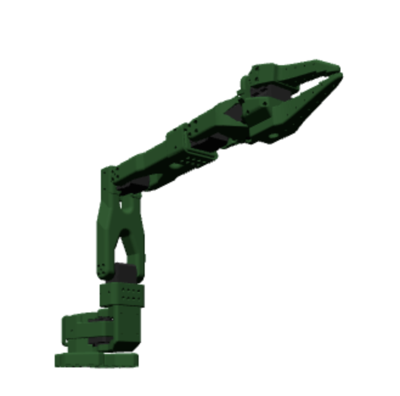

# Die Roboter

A TypeScript library for simulating and controlling robot arms with Three.js.

<p align="center">
  
</p>

## Installation

```bash
npm install die-roboter
```

## Usage

The library provides robot models that can be controlled through a simple pivot mapping system. Each pivot maps user-friendly ranges (like -100 to 100) to actual joint limits from the robot's URDF model.

## Minimal Example

```javascript
import * as THREE from 'three';
import { OrbitControls } from 'three/examples/jsm/controls/OrbitControls';
import { SO101 } from 'die-roboter';

// Setup scene
const scene = new THREE.Scene();
const camera = new THREE.PerspectiveCamera(75, window.innerWidth / window.innerHeight, 0.1, 1000);
camera.position.set(30, 30, 30);

// Setup renderer
const renderer = new THREE.WebGLRenderer({ antialias: true });
renderer.setSize(window.innerWidth, window.innerHeight);
document.getElementById('robot-view').appendChild(renderer.domElement);

// Add controls and lighting
const controls = new OrbitControls(camera, renderer.domElement);
scene.add(new THREE.AmbientLight(0xffffff, 0.6));

// Create robot
const robot = new SO101();
await robot.loadModel();
scene.add(robot);

// Animation loop
function animate() {
  requestAnimationFrame(animate);
  controls.update();
  renderer.render(scene, camera);
}
animate();

// Handle window resize
window.addEventListener('resize', () => {
  camera.aspect = window.innerWidth / window.innerHeight;
  camera.updateProjectionMatrix();
  renderer.setSize(window.innerWidth, window.innerHeight);
});
```

## Controlling the Robot

You can control the robot using the `setPivotValue` method:

```javascript
// Set shoulder pan to 50
// available options: 
// - 'shoulder_pan': Base rotation (swivel) - Range is -100 to 100
// - 'shoulder_lift': Shoulder joint (up/down movement) - Range is -100 to 100
// - 'elbow_flex': Elbow joint (bend/extend) - Range is -100 to 100
// - 'wrist_flex': Wrist pitch (up/down movement) - Range is -100 to 100
// - 'wrist_roll': Wrist rotation - Range is -100 to 100
// - 'gripper': Gripper (open/close) - Range is 0 to 100
robot.setPivotValue('shoulder_pan', 50);

// Set multiple pivots at once
robot.setPivotValues({
  'shoulder_lift': 30, 
  'elbow_flex': -20,
  'wrist_flex': 10,
  'wrist_roll': 45,
  'gripper': 0  // Close gripper, 100 is completely open
});
```

## License

Apache 2.0
