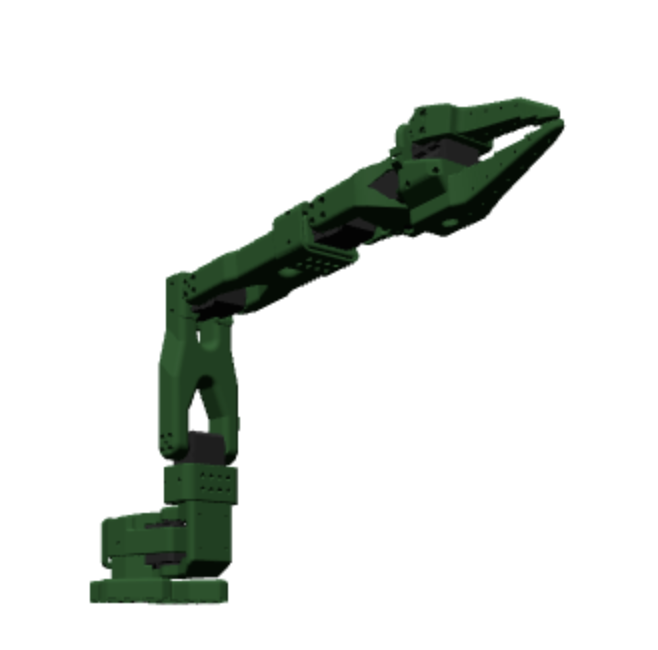

# Die Roboter

A TypeScript library for simulating and controlling robot arms with Three.js, designed to integrate with enable3d for real-time physics simulation.

<p align="center">
  
</p>

## Setup

```bash
npm install die-roboter
```

To use with physics (enable3d), also install the following packages:

```bash
npm install three enable3d @enable3d/ammo-physics urdf-loader
```

### 1) Copy the Ammo assets

You need the Ammo.js/WASM files available at runtime (served from `/ammo/kripken`).

- Copy from this repository’s prepared folder:

Source: https://github.com/therealadityashankar/die-roboter/tree/main/packages/die-roboter-example/static/ammo

Example commands to fetch just that folder:

```bash
# using git (shallow clone + copy)
git clone --depth=1 https://github.com/therealadityashankar/die-roboter tmp-die-roboter
mkdir -p static
cp -R tmp-die-roboter/packages/die-roboter-example/static/ammo static/ammo
rm -rf tmp-die-roboter
```

This will result in a structure like:

```
static/
  ammo/
    kripken/
      ammo.js
      ammo.wasm.wasm
      ...
```

### 2) Parcel setup to serve static assets

Ensure Parcel copies `static/` to your build output. One simple approach is to use `parcel-reporter-static-files-copy` (already used in the example app):

1. Install the reporter (if not already):

```bash
npm install -D parcel-reporter-static-files-copy
```

2. Add a `.parcelrc` with the reporter:

```json
{
  "extends": ["@parcel/config-default"],
  "reporters": ["...", "parcel-reporter-static-files-copy"]
}
```

3. Use Parcel scripts, similar to the example:

```json
{
  "scripts": {
    "start": "parcel index.html --open",
    "start:no-browser": "parcel index.html"
  }
}
```

With the above, everything inside `static/` (including `static/ammo/kripken`) is copied to the output, so you can initialize physics with:

```ts
import { PhysicsLoader } from '@enable3d/ammo-physics'
PhysicsLoader('/ammo/kripken', () => MainScene())
```

## Usage

The library provides robot models that can be controlled through a simple pivot mapping system. Each pivot maps user-friendly ranges (like -100 to 100) to actual joint limits from the robot's URDF model.

## Minimal Example

You can see this [example on codepen here](https://codepen.io/riversnow/pen/YPyNdOP)

```javascript
import * as THREE from 'three';
import { AmmoPhysics, PhysicsLoader } from '@enable3d/ammo-physics';
import { OrbitControls } from 'three/examples/jsm/controls/OrbitControls.js';
import { SO101, createJointSliders } from 'die-roboter';

function main() {
  const MainScene = async () => {
    // Scene
    const scene = new THREE.Scene();
    scene.background = new THREE.Color(0xf0f0f0);

    // Physics (enable3d + Ammo.js)
    const physics = new AmmoPhysics(scene, { parent: 'robot-view' });
    // physics.debug.enable(true); // uncomment to visualize colliders

    // Camera
    const camera = new THREE.PerspectiveCamera(50, window.innerWidth / window.innerHeight, 0.1, 1000);
    camera.position.set(47.564, 21.237, 43.435);
    camera.lookAt(47.13, 20.922, 42.591);

    // Renderer
    const renderer = new THREE.WebGLRenderer({ antialias: true });
    renderer.setSize(window.innerWidth, window.innerHeight);
    renderer.setPixelRatio(Math.min(2, window.devicePixelRatio));
    const container = document.getElementById('robot-view');
    if (container) container.appendChild(renderer.domElement);

    // Controls
    const controls = new OrbitControls(camera, renderer.domElement);
    controls.target.set(19.94, 1.147, -10.304);
    controls.update();

    // Lights
    scene.add(new THREE.HemisphereLight(0xffffff, 0x000000, 1));
    scene.add(new THREE.AmbientLight(0xffffff, 1));

    // Ground (static body)
    physics.add.ground({ width: 20, height: 20, name: 'ground' });

    // Example dynamic body
    const cube = new THREE.Mesh(
      new THREE.BoxGeometry(0.2, 0.2, 0.2),
      new THREE.MeshLambertMaterial({ color: 0x00ff00 })
    );
    cube.userData.grippable = true;
    cube.position.set(-4.5, 1, 0);
    scene.add(cube);
    physics.add.existing(cube);

    // Robot
    const robot = new SO101();
    await robot.load({ scene, enable3dPhysicsObject: physics, position: new THREE.Vector3(0, 0.5, 0) });

    // Optional: UI sliders to control joints
    createJointSliders(robot, 'joint-sliders', {
      shoulder_pan: 0,
      shoulder_lift: 35,
      elbow_flex: -25,
      wrist_flex: 86,
      wrist_roll: 59,
      gripper: 67
    });

    const clock = new THREE.Clock();

    function animate() {
      physics.update(clock.getDelta() * 1000);
      physics.updateDebugger();
      renderer.render(scene, camera);
      requestAnimationFrame(animate);
    }
    animate();

    // Handle window resize
    window.addEventListener('resize', () => {
      camera.aspect = window.innerWidth / window.innerHeight;
      camera.updateProjectionMatrix();
      renderer.setSize(window.innerWidth, window.innerHeight);
    });
  };

  PhysicsLoader('/ammo/kripken', () => MainScene());
}

main();
```

## Controlling the Robot

You can control the robot using the `setPivotValue` method:

```javascript
// Set shoulder pan to 50
// available options: 
// - 'shoulder_pan': Base rotation (swivel) - Range is -100 to 100
// - 'shoulder_lift': Shoulder joint (up/down movement) - Range is -100 to 100
// - 'elbow_flex': Elbow joint (bend/extend) - Range is -100 to 100
// - 'wrist_flex': Wrist pitch (up/down movement) - Range is -100 to 100
// - 'wrist_roll': Wrist rotation - Range is -100 to 100
// - 'gripper': Gripper (open/close) - Range is 0 to 100
robot.setPivotValue('shoulder_pan', 50);

// Set multiple pivots at once
robot.setPivotValues({
  'shoulder_lift': 30, 
  'elbow_flex': -20,
  'wrist_flex': 10,
  'wrist_roll': 45,
  'gripper': 0  // Close gripper, 100 is completely open
});

// Access the pivot map to get information about all pivots
const pivots = robot.pivots;
console.log(pivots['shoulder_pan']); // Get info about a specific pivot
console.log(pivots['shoulder_pan'].value); // Get current value of a pivot
```

## Physics with enable3d

This library is built to work seamlessly with [enable3d](https://enable3d.io/) to provide real-time physics simulation via Ammo.js/WASM. Internally, links use Three.js meshes as physics proxies and are registered into the physics world when you call `robot.load({ scene, enable3dPhysicsObject: physics, ... })`.

To enable physics in your app:

- Ensure you have installed the physics dependencies listed above.
- Serve the Ammo assets and point `PhysicsLoader` to them. For example, if you copy the Ammo build to `/public/ammo/kripken/`, initialize like this:

```javascript
import { PhysicsLoader } from '@enable3d/ammo-physics';
PhysicsLoader('/ammo/kripken', () => MainScene());
```

- Include the following containers in your HTML so the renderer and sliders have a place to mount:

```html
<div id="robot-view"></div>
<div id="joint-sliders"></div>
```

Tip: If you use a bundler, make sure the Ammo assets are copied to your build output. For example, with Parcel you can copy static files from a `static/` folder to `dist/` using `parcel-reporter-static-files-copy`.

## Acknowledgement

The /URDF part of the code is taken from https://github.com/julien-blanchon/RobotHub-Frontend/tree/main/src/lib/components/3d/elements/robot/URDF

## License

Apache 2.0
